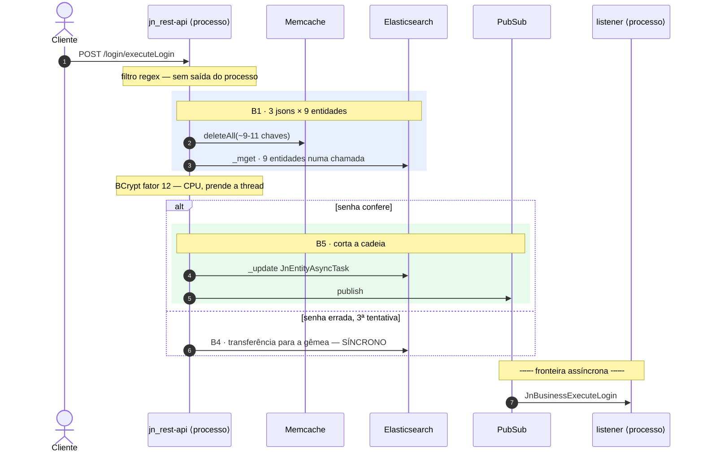

# Relatório de portas de saída

**Porta de saída = uma ida a um sistema que não é o nosso processo.** Rede ou disco. Não conta nada
que resolva em memória: bcrypt, reflexão, `CcpJsonRepresentation`, ordenação, `HashMap` de sessão.

O produto **não é uma contagem**. É um **diagrama de sequência por fluxo**, em que cada raia é um
sistema externo e cada seta que sai da raia do processo é uma saída. Ordem, ramificação e
multiplicidade ficam visíveis; o número de setas é consequência, não manchete.

Relatório de referência já produzido: `relatorio_throughputs.md` na raiz do workspace.

## Por que diagrama e não soma

Três defeitos da versão que contava pontos, todos observados neste workspace:

- **Somar portas diferentes trata como intercambiável o que não é.** `8 ES + 1 MAIL + 6 $ = 16`
  soma uma ida ao Memcache com uma ao SendGrid. **Nunca some colunas de portas diferentes.**
- **O total esconde de que lado da fronteira assíncrona está o custo.** Separe sempre `S`
  (dentro da requisição) de `L` (no listener).
- **Contagem costuma cobrir só o caminho feliz.** Foi ali que estavam os piores achados: o login
  com senha errada é mais caro que o bem-sucedido, o retry reenvia a mensagem inteira, e o
  caminho de erro tem um ciclo de realimentação. **Mapear ramo de exceção não é opcional.**

## Por que não é um `grep` por `CcpCrud`

- **A cadeia de decorators esconde quase todo o I/O.** `VisEntityResume.ENTITY.save(json)` é uma
  linha e custa 2 setas ou 400, dependendo das anotações da classe configuradora.
- **Um `save` pode não gravar nada.** `@JnEntityAsyncWriter` tem prioridade 8 e **corta a cadeia**.
- **O que parece gratuito às vezes não é.** `BCrypt.gensalt(12)` não gera seta e prende a thread por
  trabalho exponencial. Anote como `Note over`, nunca omita.

## Passo 1 — confirmar as portas daquele módulo

```bash
grep -rn "loadAllDependencies" -A 20 --include=*.java \
  jn_rest-api_spring_jobsnow_dependency-chooser/src \
  vis_rest-api_spring_jobsnow_dependency-chooser/src \
  jb_instant-messenger-listener_jobsnow_dependency-chooser/src \
  jn_mensageria-consumer_gcp-pubsub-push-spring_dependency/src
```

| Porta | Interface | Produção | Local | `jb` |
|---|---|---|---|---|
| Banco | `CcpCrud` e cia. | Elasticsearch HTTP | igual | igual |
| Cache | `CcpCache` | `CcpGcpMemCache` → rede | `CacheMap` → **sem raia** | `CacheMock` noop → **sem raia** |
| Fila | `CcpMensageriaSender` | PubSub | `SyncMensageriaListener` → **sem raia** | idem → **sem raia** |
| E-mail | `CcpEmailSender` | SendGrid | `LocalEmailFile` → **HD** | arquivo → **HD** |
| Mensageiro | `CcpInstantMessenger` | Telegram HTTP | igual | igual |
| Bucket | `CcpFileBucket` | GCP Storage | `c:/logs/` → HD | não registrado |
| Propriedades | `CcpPropertiesDecorator` | env var → memória; senão **HD** | idem | idem |

**Desenhe produção** e anote no diagrama as raias que somem em outro ambiente.

**Armadilhas:**
- `JbInstantMessengerDependencyChooser:31-42` **não chama `isLocalEnvironment()`** — fixa `CacheMock`
  e fila síncrona no código. O `jb` não tem raia de cache em ambiente nenhum, e como todo `get` dá
  miss, a carga é desviada para o Elasticsearch.
- `VisRestApiSpringStarter` **não registra** `CcpEmailSender` nem `CcpInstantMessenger`. Fluxo VIS
  que chegue em `JnSendMessageToUser` falha na resolução da dependência, dentro do listener.

## Passo 2 — a ordem da cadeia de decorators

`CcpEntityDecoratorTypes` + os `@CcpEntityCustomDecorator(priority = N)` da entidade.
**Maior prioridade = mais externo.**

```
10 FieldsValidator → 9 DataReadOnly → 8 JnAsyncWriterEntity ⟂ CORTA
 → 7 BeforeWrite/BeforeSendMessage → 6 FieldsTransformer
 → 5 AfterWrite/AfterSendMessage → 4 Twin → 3 Cache → 2 Versionable → 1 Disposable → ES
```

```bash
grep -E "^@[A-Z]|priority = |twinEntityName|operationType" \
  <modulo>/src/main/java/com/<cc>/entities/<Entidade>.java | tr -s ' '
```

| Anotação | Efeito no desenho |
|---|---|
| `@CcpEntityCache(n)` | `getOneById` e `exists` passam pelo cache. **Consulta a union-all não** — ver Passo 3 |
| `@CcpEntityTwin` | `save`/`delete` viram union-all + bulk → 2 setas ao ES |
| `@JnEntityAsyncWriter` | **corta**: 1 ES + 1 publish aqui, cadeia inteira no listener |
| `@JnEntityVersionable` | `toBulkItems` lê o estado anterior → +1 ES por item |
| `@JnEntityDisposable` | acrescenta documentos ao `_mget` e itens ao `_bulk` |
| `@CcpEntityOperations` | executa `CcpBusiness` antes/depois da escrita — **siga cada um** |
| `@JnEntitySendMessageToUserWhenWrite` | dispara B7 — e **o sufixo do `operationType` diz o que acontece se o envio falhar**: `ThrowAnError`, `SaveAWarning` (grava `JnEntityJobsnowWarning`) ou `LogTheError` (idem + `printStackTrace`) |

## Passo 3 — o catálogo de blocos

| Bloco | O que é | Setas |
|---|---|---|
| **B1** `crud.unionAll(J jsons, E entidades)` | `deleteAll` das chaves + um `_mget` | 1 ES + 1 `$` |
| **B2** consulta ao union-all | `isPresentInThisUnionAll` · `getRecordFromUnionAll` | **nenhuma** — memória |
| **B3** `save` em entidade cacheada | `_update` + `put` | 1 ES + 1 `$` |
| **B4** `save`/`delete` em entidade twin | union-all + bulk | 2 ES + ~2 `$` |
| **B5** `save`/`delete` em `@JnEntityAsyncWriter` | grava `JnEntityAsyncTask` + publica | 1 ES + 1 MQ |
| **B6** `executeBulk(n)` | um `_bulk` + limpeza em lote | 1 ES + 1 `$` |
| **B7** `JnSendMessageToUser`, 1 canal | 2 union-alls + envio + registro | 3 ES + 1 canal + 3 `$` |
| **B8** `JnMensageriaReceiver.saveResult` | todo listener paga | 1 ES |
| **B9** filtro `ValidateLogin` | `CcpPutSessionValuesAndExecuteTaskFilter` | 1 ES + 1 `$` |
| **B10** `toBulkItems` versionável | `getRecordToAudit` | +1 ES por item |

**`J × E` no B1 é teto, não típico:** `calculateId` lança `CcpErrorEntityPrimaryKeyIsMissing` quando
o json não carrega a PK daquela entidade, e a combinação morre num `catch` vazio
(`CcpCrud.deleteKeysInCache:56-72`).

**Não "reative o cache" em `getRecordFromUnionAll` / `isPresentInThisUnionAll`.** Eles delegam sem
tocar no cache **de propósito** — o `_mget` já trouxe tudo para a RAM. O javadoc de
`DecoratorCacheEntity` explica. Se voltar a aparecer um `for` com `cache.delete()` dentro de
`JnDeleteKeysFromCache`, é regressão.

## Passo 4 — os filtros

O endpoint começa a gastar antes do controller. Confira a que padrão ele responde **de verdade**:

```bash
grep -rn "addUrlPatterns\|@RequestMapping(\"" --include=*.java \
  jn_rest-api_spring_jobsnow_dependency-chooser/src vis_rest-api_spring_jobsnow_dependency-chooser/src
```

No VIS o filtro está registrado para `/position/*` e o controller mora em
`recruiters/{email}/positions/{title}` — não casa, e o endpoint atende sem validar sessão.

## Passo 5 — seguir a fila

```bash
grep -rn "new JnFunctionMensageriaSender(" --include=*.java . | grep -v "/src/test/"
```

- **`JnFunctionMensageriaSender(CcpBusiness topic)`** → tópico é o nome da classe. **Abra a classe**:
  `VisBusinessPositionResumesSend` e `VisBusinessRecruiterReceivingResumes` devolvem o json sem
  fazer nada — fila real, consumidor vazio, B8 pago do mesmo jeito.
- **`JnFunctionMensageriaSender(CcpEntity, CcpEntityOperationType)`** → tópico é a classe
  configuradora. O listener reconstrói a entidade **sem** o decorator de prioridade 8 e executa a
  cadeia inteira. É aqui que mora quase todo o custo.

Custo fixo de qualquer listener: B8.

## Passo 6 — os ramos de exceção ⚠️ obrigatório

O caminho feliz é metade do fluxo. Para **cada** fluxo, rastreie:

**1. Todo `catch` do caminho.** Alguns gravam, alguns engolem, alguns relançam:

| Onde | Ramo | Setas |
|---|---|---|
| `JnBusinessSendHttpRequest.apply:43-60` | 5xx → retry; 4xx → grava `JnEntityHttpApiErrorClient` e relança; `Throwable` → `exceptionHandler` | 1 ES por ramo |
| `JnBusinessSendHttpRequest.retryToSendIntantMessage:76` | **chama `this.execute(json)` — reenvia a mensagem inteira**, não só o HTTP | ×maxTries |
| `JnMessageType.instantMessenger.apply:109-116` | 429 → retry próprio (contador **independente** do de cima); bot bloqueado → grava `JnEntityInstantMessengerBotLocked` e **devolve normalmente** | 1 ES |
| `JnMessageSenderExceptionHandler:17-36` | `LENIENT` e `LOG` gravam `JnEntityJobsnowWarning` — que é async-writer **e notifica o suporte** | 1 ES + 1 MQ + B7 |
| `JnMensageriaReceiver.executeProcess:54-62` | falha do listener → `saveResult(success=false)`. **Sem retry, sem DLQ** — a mensagem some e a falha vira uma linha que ninguém lê | 1 ES |
| `CcpEntityMetaData:162-170` | não encontrado → executa `ifNotFound`, que em `CcpEntity.getOneById` lança `CcpErrorFlowDisturb(NOT_FOUND)` | 0 |
| `CcpCrud.deleteKeysInCache` | `catch` vazio quando falta a PK | 0 |

**2. O caminho de erro transversal.** Toda exceção não tratada em endpoint REST cai em
`CcpRestApiExceptionHandlerSpring.handle(Throwable):76-87` → `genericExceptionHandler`, registrado
nos dois Starters como `save` em `JnEntityJobsnowError` — que é `@JnEntityAsyncWriter` **e**
`@JnEntitySendMessageToUserWhenWrite`. **Um 500 custa mais que o endpoint que o produziu.** Além
disso, `getHandledExceptionToLog:109-124` relê `application_properties` a cada exceção, sem
memoização (`CcpInputStreamDecorator:112-129`): se a env var não estiver definida, é leitura de
disco por erro.

**3. Ramos de bifurcação do negócio, não só de exceção.** Em `JnBusinessEvaluateAttempts.apply:97-125`
há três saídas distintas — acerto (publica), erro com tentativas restantes (grava tentativa), erro
na última tentativa (**bloqueia inline**, porque `JnEntityLoginPassword` é twin e versionável mas
**não** é async-writer). As três têm custo diferente e a do meio não é a mais cara.

**4. Cache miss.** `DecoratorCacheEntity.exists:52-73` no miss faz `entity.exists` **e**
`getOneById` — duas idas ao banco no mesmo registro. `getOneByIdOrHandleItIfThisIdWasNotFound` não
passa pelo decorator: entidade com `@CcpEntityCache` lida por esse caminho **nunca** usa o cache.

## Passo 7 — desenhar

Diagrama de sequência Mermaid, um por fluxo. As **raias são os sistemas externos**.

````

````

Regras:

- **`Note over` para o que não gera seta** — memória, CPU, reflexão. É o que prova a disciplina da
  métrica e evita que o leitor ache que foi esquecido.
- **`rect` rotulado com o nome do bloco**, com as setas inline dentro. Vê-se ao mesmo tempo cada
  seta e a que bloco pertence.
- **`alt`/`else` para ramos de exceção**, na mesma altura do caminho feliz — não numa seção separada.
- **`loop` com o teto no rótulo**; se o teto for desconhecido, escreva `⛔ teto desconhecido` e diga
  o que o faz crescer.
- **`opt` para ida condicional** que pode simplesmente não acontecer.
- **Divisor `╌╌╌ fronteira assíncrona ╌╌╌`** entre o que está dentro da requisição e o que roda
  depois da resposta.
- **`⛔` marca ramo que leva a custo não limitado ou a defeito.**
- **Tabela de call sites depois do diagrama**, casando com o `autonumber`. **Toda seta precisa de
  `arquivo:linha` ou não entra no desenho.**

Endpoints triviais (uma seta só) **não ganham diagrama** — entram como linha no índice.

## Passo 8 — o arquivo

Markdown na raiz do workspace, nesta ordem:

1. **O que está sendo desenhado** — definição, `flowchart` do mapa geral de portas, tabela
   produção/local/`jb`, notação, e a frase "este relatório não estima latência".
2. **Índice de endpoints** — uma linha por fluxo, **uma coluna por porta, sem soma**, colunas `S` e
   `L` separadas, mais "ramos de exceção mapeados?" e "limitado?". Ordem **ordinal**: pela porta
   mais pesada alcançada (canal externo → fila → banco → cache → nenhuma), e dentro de cada classe
   pelo número de setas. **Não invente peso nem multiplique por latência estimada.**
3. **Catálogo de blocos** — B1, B5 e B7 desenhados; o resto em tabela.
4. **Diagramas por fluxo** — diagrama + tabela de call sites + um bloco "o que o mapeamento dos
   ramos revelou" quando houver achado.
5. **Caminho de erro transversal** — seção própria, porque vale para todos os endpoints.
6. **Mapa de DI por aplicação** — inclusive o que **não** está registrado.
7. **Achados** — o que dá para eliminar; substituição prevista (e como o **modo de falha** muda,
   não a contagem); o que o framework faz bem; e onde medir latência de verdade.
8. **Histórico** — por que os números antigos eram maiores.

## Armadilhas

- **Nunca some colunas de portas diferentes.** Se precisar ordenar, ordene ordinalmente.
- **Nunca publique latência estimada.** A análise é estática; ela sabe ordenar portas, não
  cronometrá-las. Para medir: decorator de cronometragem nas interfaces de
  `com.ccp.especifications`, que é por onde todo acesso externo passa.
- **Um `_mget` não é N buscas.** `CcpGetEntityId` com 9 entidades é **uma** seta. Contar 9 faz o
  framework parecer pior do que é.
- **Confira o chooser antes de desenhar a raia de cache.** `@CcpEntityCache` na entidade não garante
  tráfego: se o módulo registrou `CacheMock`, é noop.
- **Ponto de entrada não é necessariamente produção.** `JbInstantMessengerReaderStarter` tem
  `for(;;)`, mas o javadoc diz que é ponto de entrada de teste manual.
- **Ambiente local mente nos dois sentidos**: o cache some e todo o custo do listener entra na
  requisição.
- **`getDeclaredClasses()` não respeita ordem de código-fonte** — para achar o enum `Fields` de uma
  entidade, varra todos os tipos aninhados.
- **Registre o que está bom.** `crud.unionAll` com 9 tabelas num `_mget` e `CcpExecuteBulkOperation`
  juntando as escritas num `_bulk` são acertos. Relatório só com problemas induz a otimizar o lugar
  errado.
