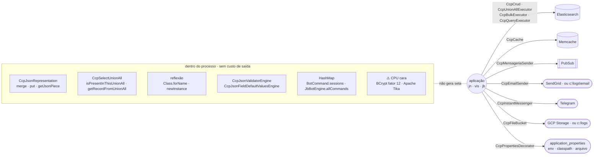
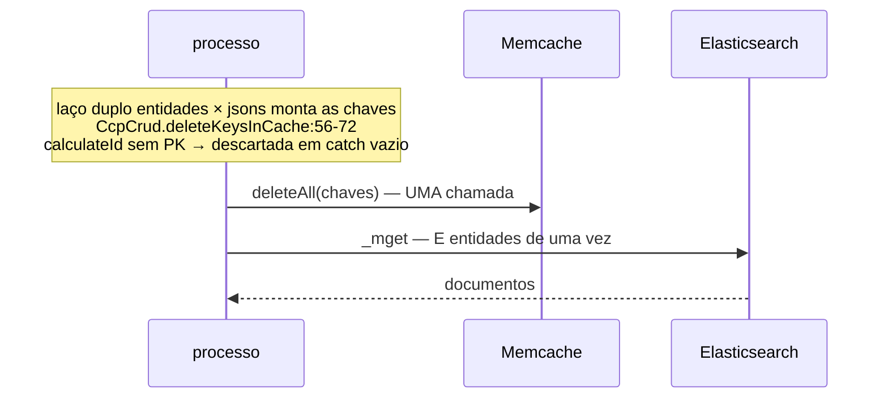
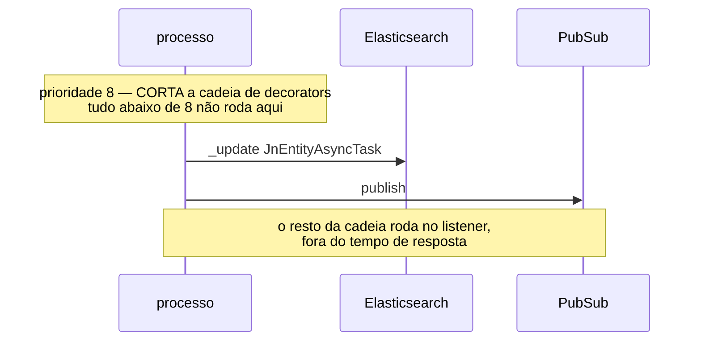
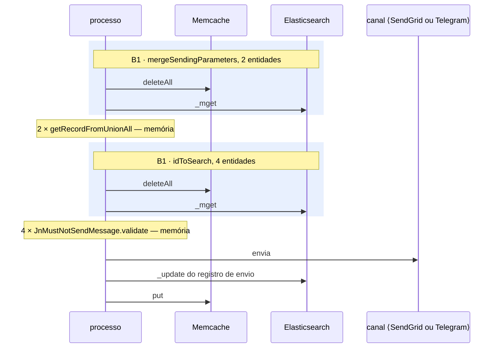
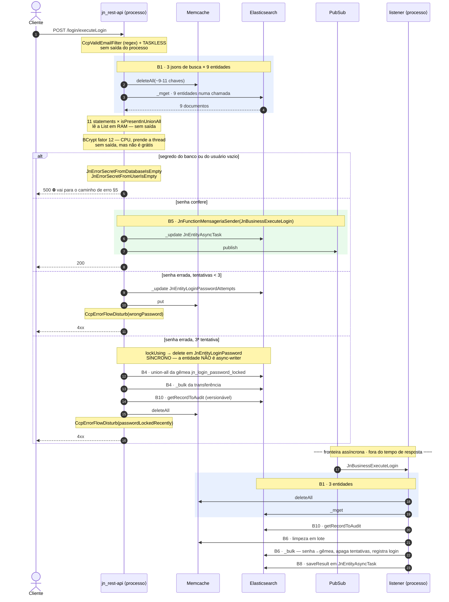
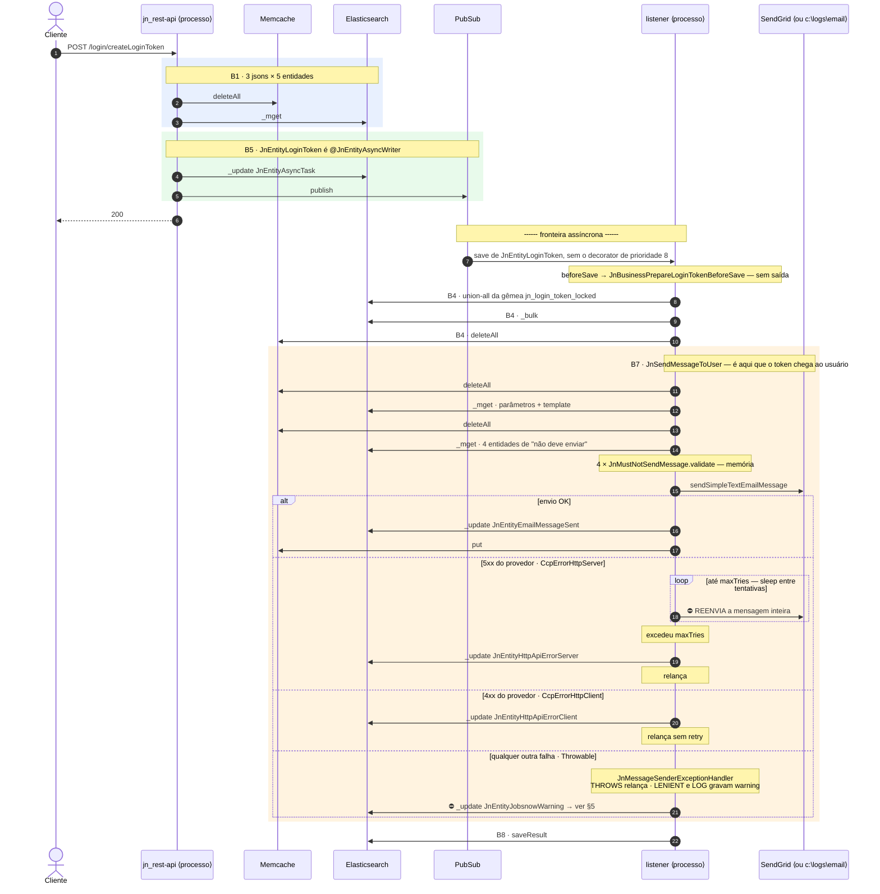
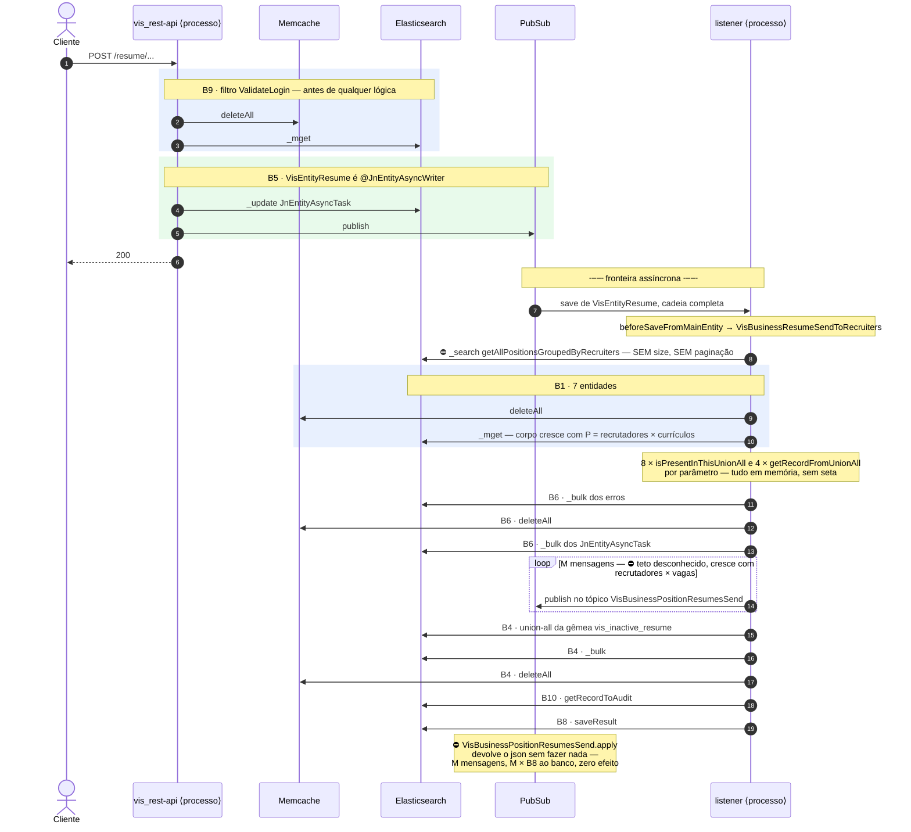
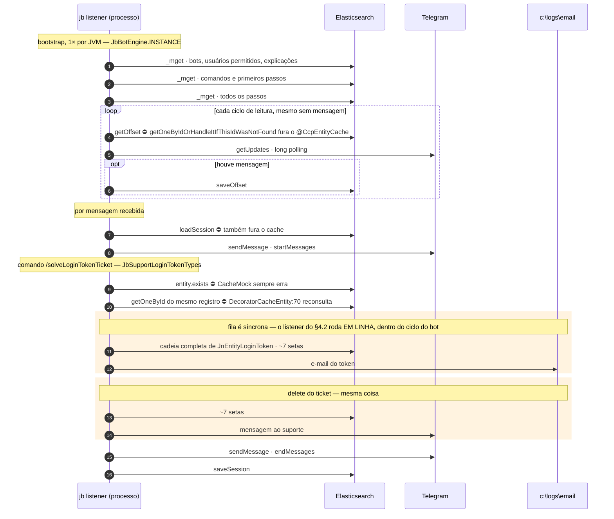
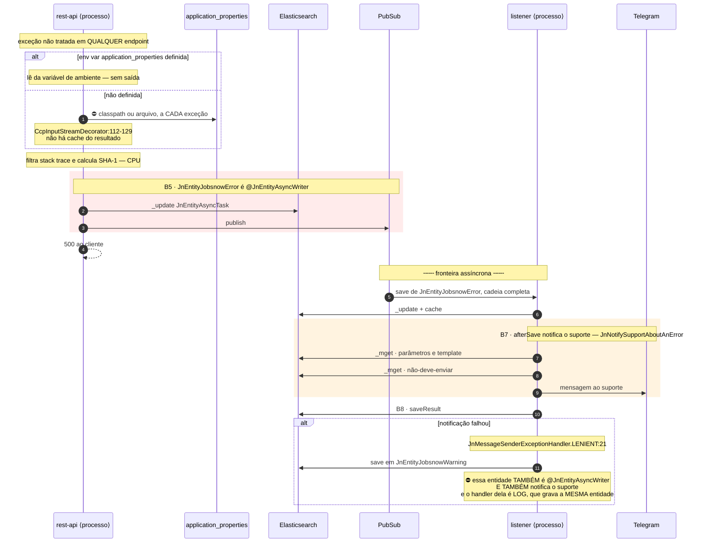

# Relatório de portas de saída — jobsnow

Data: 2026-09-24 · Escopo: endpoints REST do `jn` e do `vis`, `JbInstantMessengerMessageReader`,
os consumidores de toda fila alcançada, **e os ramos de exceção de cada um**.

> **Este relatório mudou de formato em 2026-09-24.** As versões anteriores contavam pontos e
> somavam colunas. Esta desenha por onde a informação passa. O motivo está em §8.

---

## 1. O que está sendo desenhado

**Porta de saída = uma ida a um sistema que não é o nosso processo.** Rede ou disco. Nada que
resolva em memória aparece como seta.

### O mapa geral



`CcpDependencyInjection` resolve cada porta em tempo de execução. **A implementação muda por
aplicação e por ambiente**, e com ela muda se a seta cruza ou não a fronteira do processo:

| Porta | Interface | Produção | Local (`localEnvironment = true`) | `jb` (fixo no código) |
|---|---|---|---|---|
| Banco | `CcpCrud` e cia. | Elasticsearch HTTP | **igual** | **igual** |
| Cache | `CcpCache` | `CcpGcpMemCache` → rede | `CacheMap` → `HashMap` → **sem seta** | `CacheMock` → noop → **sem seta** |
| Fila | `CcpMensageriaSender` | PubSub → rede | `SyncMensageriaListener` → mesma thread → **sem seta** | idem local → **sem seta** |
| E-mail | `CcpEmailSender` | SendGrid → rede | `LocalEmailFile` → **HD** | `LocalEmailFile` → **HD** |
| Mensageiro | `CcpInstantMessenger` | Telegram HTTP | **igual** | **igual** |
| Bucket | `CcpFileBucket` | GCP Storage | `c:/logs/<bucket>/` → **HD** | não registrado |
| Propriedades | `CcpPropertiesDecorator` | env var → memória; senão classpath/arquivo → **HD** | idem | idem |

**Convenção deste relatório: os diagramas são de produção.** Onde uma raia desaparece em outro
ambiente, isso está anotado no próprio diagrama.

### Notação

| Elemento | Significa |
|---|---|
| `raia` | um sistema externo — uma porta de saída |
| `seta cheia →` | ida ao sistema externo |
| `seta tracejada ⤎` | resposta |
| `Note over` | trabalho que **não** gera seta (memória, CPU, reflexão) — aparece para provar a regra |
| `alt` / `else` | ramos mutuamente exclusivos, inclusive os de exceção |
| `opt` | ida condicional, que pode simplesmente não acontecer |
| `loop` | ida repetida — **quando o teto não é conhecido, está escrito no rótulo** |
| `rect` | bloco composto do catálogo (§3) |
| `⛔` | ramo que leva a custo não limitado ou a defeito |

Toda seta tem `arquivo:linha` na tabela que segue o diagrama.

### O que este relatório não faz

Não estima latência. As setas **não são comparáveis entre raias** — uma ida ao Memcache e uma ao
SendGrid são ambas uma seta e não custam a mesma coisa. Quem quiser comparar precisa medir; o lugar
para isso está indicado em §7.

---

## 2. Índice de endpoints

Ordenado pela **porta mais pesada que o fluxo alcança** (canal externo → fila → banco → cache →
nenhuma) e, dentro de cada classe, pelo número de setas. Sem somas: cada coluna é contada separada,
porque as portas não são intercambiáveis.

`S` = dentro da requisição · `L` = no listener, depois da resposta.

| Fluxo | Ponto de entrada | ES | `$` | MQ | Canal | Ramos de exceção | Limitado? |
|---|---|---|---|---|---|---|---|
| Bot: resolver ticket de token | `JbInstantMessengerMessageReader` → `JbSupportLoginTokenTypes` | ~20 S | — | — | 3 IM + 2 HD | ✅ §4.4 | ✅ |
| Criar token de login | `JnRestApiLogin.createLoginToken` | 2 S + 6 L | 1 S + 5 L | 1 S | 1 MAIL L | ✅ §4.2 | ⚠️ retry ×3 |
| Reenviar / desbloquear token | `JnRestApiLogin.resendLoginToken` · `unlockLoginToken` | 2 S + 6 L | 1 S + 5 L | 1 S | 1 MAIL L | ✅ §4.2 | ⚠️ retry ×3 |
| Pedir criação de skill | `VisRestApiSkill.requestToCreateNewSkill` | 2 S + 5 L | 1 S + 4 L | 1 S | 1 L ⛔ | ✅ §6 | ⛔ canal não registrado |
| Sugerir correção de hierarquia | `VisRestApiSkill.saveHierarchyFixSuggestion` | 2 S + 4 L | 1 S + 3 L | 1 S | 1 L ⛔ | ✅ §6 | ⛔ canal não registrado |
| Salvar currículo | `VisRestApiResume.save` | 2 S + 8 L | 1 S + 3 L | 1 S + **M** L | — | ✅ §4.3 | ⛔ query sem `size`, M publishes |
| Apagar / inativar currículo | `VisRestApiResume.delete` · `changeStatus` | 2 S + 4 L | 1 S + 2 L | 1 S | — | ✅ §4.3 | ⚠️ vira o de cima se vier da gêmea |
| Salvar senha | `JnRestApiLogin.savePassword` | 2 S + 4 L | 1 S + 2 L | 1 S | — | ✅ §4.1 | ✅ |
| Login com senha | `JnRestApiLogin.executeLogin` | 2 S + 4 L | 1 S + 2 L | 1 S | — | ✅ §4.1 | ✅ |
| Logout | `JnRestApiLogin.executeLogout` | 2 S + 3 L | 1 S + 2 L | 1 S | — | parcial | ✅ |
| Salvar / inativar vaga | `VisRestApiPosition.save` · `changeStatus` | 2 S + 3 L | 1 S + 1 L | 1 S | — | parcial | ✅ |
| Opinar sobre currículo | `VisRestApiRecruiter.saveOpinion…` | 2 S + 1 L | 1 S | 1 S | — | parcial | ✅ |
| Enviar currículos por e-mail | `VisRestApiRecruiter.sendResumesToEmail` | 2 S + 1 L | — | 1 S | — | parcial | ⛔ **listener é no-op** |
| Ler dados do currículo | `VisRestApiResume.getData` | 3 S | 2 S | — | — | parcial | ✅ |
| Criar e-mail de login | `JnRestApiLogin.createLoginEmail` | 2 S | 2 S | — | — | parcial | ✅ |
| Salvar respostas do pré-cadastro | `JnRestApiLogin.saveAnswers` | 2 S | 2 S | — | — | parcial | ✅ |
| Currículos vistos / vagas do recrutador | `VisRestApiRecruiter.getAlreadySeen…` | 2 S | 1 S | — | — | parcial | ✅ |
| Existe e-mail de login? | `JnRestApiLogin.existsLoginEmail` | 1 S | 1 S | — | — | parcial | ✅ |
| Listar currículos da vaga / sugerir skills | `VisRestApiPosition.getResumeList` · `suggestNewSkills` | 1 S | 1 S | — | — | parcial | ⚠️ resultado errado |
| Validar sessão | `JnRestApiLogin.validateLogin` | 1 S | 1 S | — | — | parcial | ✅ |
| Ler dados da vaga | `VisRestApiPosition.getData` | 1 S | 1 S | — | — | parcial | ✅ |
| Autocompletar empresa | `VisRestApiCompany.searchCompanies…` | 1 S | — | — | — | parcial | ⚠️ ignora o próprio cache |
| Extrair skills de texto | `VisRestApiSkill.getSkillsFromText` | 1 S | `2+F+G` | — | — | parcial | ⛔ cresce com o texto (até 5 MB) |
| Endpoint de erro proposital | `JnRestApiLogin.apenasDeErro` | 1 S | 1 S | — | — | ✅ §5 | ✅ |
| Extrair skills do texto da vaga | `VisRestApiPosition.getImportantSkillsFromText` | — | — | — | — | — | — |
| Status de tarefa assíncrona | `JnRestApiAsyncTask.getAsyncTaskStatusById` | — | — | — | — | — | ⚠️ corpo comentado |

> **§5 vale para toda linha desta tabela.** Qualquer endpoint que estoure uma exceção não tratada
> paga o caminho de erro transversal, que nenhuma coluna acima contabiliza.

---

## 3. Catálogo de blocos

Desenhados uma vez; nos diagramas de endpoint aparecem inline, dentro de um `rect` com o nome do
bloco, para que se veja ao mesmo tempo cada seta e a que bloco ela pertence.

### B1 · `crud.unionAll(J jsons, E entidades)`



`J × E` é o **teto**, não o típico. Em `ExecuteLogin`, `9 × 3 = 27` vira ~9–11 chaves reais, porque
dois dos três jsons de busca só servem a `JnEntityDisposableRecord`.

### B5 · `save`/`delete` em entidade `@JnEntityAsyncWriter`



### B7 · `JnSendMessageToUser`, um canal



### Demais blocos

| Bloco | O que é | Setas |
|---|---|---|
| **B2** consulta ao union-all | `isPresentInThisUnionAll` · `getRecordFromUnionAll` | **nenhuma** — é memória |
| **B3** `save` em entidade cacheada | `_update` + `put` | 1 ES + 1 `$` |
| **B4** `save`/`delete` em entidade twin | union-all + bulk | 2 ES + ~2 `$` |
| **B6** `executeBulk(n)` | um `_bulk` + limpeza em lote | 1 ES + 1 `$` |
| **B8** `JnMensageriaReceiver.saveResult` | todo listener grava o desfecho | 1 ES |
| **B9** filtro `ValidateLogin` | `CcpPutSessionValuesAndExecuteTaskFilter` | 1 ES + 1 `$` |
| **B10** `toBulkItems` versionável | `getRecordToAudit` | +1 ES por item |

### Onde a cadeia de decorators corta

```
10 FieldsValidator → 9 DataReadOnly → 8 JnAsyncWriterEntity ⟂ CORTA
 → 7 BeforeWrite/BeforeSendMessage → 6 FieldsTransformer
 → 5 AfterWrite/AfterSendMessage → 4 Twin → 3 Cache → 2 Versionable → 1 Disposable → ES
```

---

## 4. Diagramas por fluxo

### 4.1 — `JnRestApiLogin.executeLogin`



| # | Porta | Call site |
|---:|---|---|
| 1 | — | `JnRestApiLogin.executeLogin` |
| 2 | Memcache | `CcpCacheDecorator.deleteAll` ← `CcpCrud.deleteKeysInCache:56-72` |
| 3 | Elasticsearch | `crud.unionAll` → `_mget` |
| 5–6 | ES + Memcache | `JnBusinessEvaluateAttempts.apply:119` → `entityToGetTheAttempts.save` |
| 7–10 | ES + Memcache | `JnBusinessEvaluateAttempts.apply:108` → `lockUsing` ← `JnServiceLogin.java:318` |
| 12–17 | — | `JnBusinessExecuteLogin` · `JnMensageriaReceiver.executeProcess:49-63` |

**O que o mapeamento dos ramos revelou:**

> **O caminho de erro é mais caro dentro da requisição do que o caminho de sucesso.**
> O sucesso paga 2 setas ao ES e delega o resto à fila (B5). A terceira senha errada paga **3 setas
> ao ES inline** — porque `JnEntityLoginPassword` tem `@CcpEntityTwin` e `@JnEntityVersionable`
> mas **não** tem `@JnEntityAsyncWriter`, então a transferência para a gêmea acontece dentro da
> requisição. Quem erra a senha consome mais recurso por requisição do que quem acerta, e o
> ranking por caminho feliz dizia o contrário.

### 4.2 — `JnRestApiLogin.createLoginToken` · e o duplo retry do envio



| # | Porta | Call site |
|---:|---|---|
| 2–3 | Memcache + ES | `JnServiceLogin.CreateLoginToken` → `crud.unionAll` |
| 4–5 | ES + PubSub | `JnAsyncWriterEntity` (prioridade 8) |
| 7–9 | ES + Memcache | `DecoratorTwinEntity.save` |
| 10–13 | Memcache + ES | `JnSendMessageToUser.executeAllSteps` |
| 14 | SendGrid / HD | `JnMessageType.email.apply:54` |
| 15–16 | ES + Memcache | `JnMessageType.email.apply:55` |
| 18 | SendGrid / HD | `JnBusinessSendHttpRequest.retryToSendIntantMessage:76` — **recursão em `this.execute(json)`** |
| 19 | ES | `JnBusinessSendHttpRequest.retryToSendIntantMessage:69` |
| 20 | ES | `JnBusinessSendHttpRequest.apply:55` |
| 21 | ES | `JnMessageSenderExceptionHandler.LENIENT:21` · `LOG:31` |

**O que o mapeamento dos ramos revelou:**

> **O retry reenvia a mensagem, não só a requisição HTTP.**
> `JnBusinessSendHttpRequest.retryToSendIntantMessage:76` chama `this.execute(json)` — o `apply`
> inteiro, do começo. No canal de e-mail isso significa **o usuário recebe o e-mail uma vez por
> tentativa** se o provedor devolver 5xx depois de já ter enfileirado a mensagem. Hoje é
> inofensivo, porque `LocalEmailFile` grava em disco e não devolve 5xx. **Vira real no dia em que
> o SendGrid entrar** — é a mudança de §7 com o maior risco embutido.

> **Há dois mecanismos de retry aninhados, com contadores independentes.**
> `JnBusinessSendHttpRequest` reenvia em 5xx (`attempts`), e `JnMessageType.instantMessenger`
> reenvia em `CcpHttpTooManyRequests` (`triesToSendMessage`, `JnMessageType.java:119-138`). Um não
> conhece o outro. No canal Telegram, um 429 seguido de 5xx pode multiplicar as duas contagens.

### 4.3 — `VisRestApiResume.save`



| # | Porta | Call site |
|---:|---|---|
| 2–3 | Memcache + ES | `CcpPutSessionValuesAndExecuteTaskFilter:33-61` → `JnServiceLogin.ValidateLogin` |
| 4–5 | ES + PubSub | `JnAsyncWriterEntity` |
| 7 | ES | `VisUtils.getAllPositionsGroupedByRecruiters` → `queryExecutor.getMap` |
| 8–9 | Memcache + ES | `unionAllExecutor.unionAll(allSearchParameters, 7 entidades)` |
| 10–12 | ES + Memcache | `JnExecuteBulkOperation.executeBulk` |
| 13 | PubSub | `mensageria.sendToMensageria` — **1 publish por mensagem** |
| 14–16 | ES + Memcache | `DecoratorTwinEntity.save` |

### 4.4 — `JbInstantMessengerMessageReader`

> **O `jb` não tem raia de Memcache nem de PubSub, em ambiente nenhum.**
> `JbInstantMessengerDependencyChooser:31-42` **não chama `isLocalEnvironment()`**: fixa
> `CacheMock` (noop puro — `get` devolve `null` sempre) e `SyncMensageriaListener` no código.
> Banco e Telegram são os reais. Como todo `get` dá miss, a carga é desviada **para o
> Elasticsearch**.



**O que o mapeamento dos ramos revelou:**

> **`DecoratorCacheEntity.exists` consulta o banco duas vezes no mesmo registro.**
> Em `exists:63` o `entity.exists(json)` já confirma a existência; em `:70` o
> `this.getOneById(json)` vai buscar o documento **de novo**, só para ter o que colocar no cache.
> Com `CacheMock`, o `put` seguinte é noop — as duas idas ao Elasticsearch acontecem e o resultado
> é descartado. No `jn` e no `vis`, onde o cache é real, o custo se paga na próxima leitura; no
> `jb`, nunca.

> **O ponto de entrada não é produção.** `JbInstantMessengerReaderStarter` tem `for(;;)` com
> `sleep(3000)`, mas o javadoc da classe diz que ela serve para testar o bot manualmente. O custo
> ocioso do `loop` acima só vira problema se alguém promover esse starter a daemon.

---

## 5. ⚠️ O caminho de erro transversal

**Não está em nenhuma linha do §2, e vale para todos os endpoints dos dois aplicativos REST.**

Quando uma exceção não é `CcpJsonValidationError` nem `CcpErrorFlowDisturb`, ela cai em
`CcpRestApiExceptionHandlerSpring.handle(Throwable):76-87`. E o `genericExceptionHandler` está
registrado, nos dois Starters, como **um `save` em `JnEntityJobsnowError`**
(`JnRestApiSpringStarter.java:98`, `VisRestApiSpringStarter.java:92`).

Essa entidade tem `@CcpEntityCache(3600)`, `@JnEntityAsyncWriter`, `@JnEntityDisposable` **e**
`@JnEntitySendMessageToUserWhenWrite(…SendAnInstantMessage…IfFailsSaveAWarning)`.



Três consequências que só apareceram ao desenhar o ramo de exceção:

**1. Um erro 500 custa mais que o endpoint que o produziu.** `existsLoginEmail` com sucesso tem
1 seta ao ES. O mesmo endpoint falhando tem 1 ES + 1 publish síncronos, mais ~5 setas e uma
mensagem de Telegram no listener. **O sistema fica mais caro exatamente quando está com problema.**

**2. Pode haver leitura de disco por exceção.** `getHandledExceptionToLog:109-124` chama
`environmentVariablesOrClassLoaderOrFile()` a cada chamada, sem memoização
(`CcpInputStreamDecorator:112-129`). Se a variável de ambiente `application_properties` estiver
definida, resolve em memória; se não, **lê classpath ou arquivo a cada erro**. Qual dos dois vale
depende do deploy — é a primeira coisa a conferir num incidente de erro em massa.

**3. ⛔ Existe um ciclo de realimentação no caminho de erro, e ele está armado no VIS.**
A cadeia é: erro → `JnEntityJobsnowError` → notifica suporte por Telegram → **se falhar**, `LENIENT`
grava `JnEntityJobsnowWarning` → que é async-writer → que **também** notifica o suporte por Telegram
→ **se falhar**, `LOG` grava `JnEntityJobsnowWarning` de novo → que publica de novo.

Cada volta é uma mensagem nova na fila, não uma chamada recursiva — não estoura pilha, **realimenta
a fila**. E o `VisRestApiSpringStarter` **não registra `CcpInstantMessenger`** (§6), então no VIS
toda tentativa de notificar falha na resolução da dependência: a condição de entrada do ciclo é
permanente, não excepcional.

> **O que falta confirmar:** se o `save` repetido de `JnEntityJobsnowWarning` com a mesma chave
> primária é deduplicado **antes** do publish, o ciclo se estabiliza em vez de crescer. Isso não dá
> para afirmar por leitura — depende do `sanitizeItems` e da chave calculada em runtime. É o
> próximo teste a escrever, e ele é barato: salvar um `JnEntityJobsnowWarning` com o mensageiro
> ausente e contar as mensagens publicadas.

---

## 6. Mapa de dependências por aplicação

`A / B` = "produção / local", escolhido por `isLocalEnvironment() ? B : A`. Sem barra = fixo no código.

| Aplicação | Consulta `isLocalEnvironment()`? | Fila | E-mail | Bucket | Cache | Mensageiro |
|---|---|---|---|---|---|---|
| `jn_rest-api_spring` | **sim** | PubSub / sync | SendGrid / arquivo | GCP / local | Memcache / `CacheMap` | Telegram (fixo) |
| `vis_rest-api_spring` | **sim** | PubSub / sync | ⛔ **não registrado** | GCP / local | Memcache / `CacheMap` | ⛔ **não registrado** |
| `jb_instant-messenger-listener` | ⛔ **não** | sync (fixo) | arquivo (fixo) | — | ⛔ `CacheMock` noop (fixo) | Telegram (fixo) |
| `jn_mensageria-consumer_pubsub-push` | **sim** | PubSub / sync | — | — | — | — |

**⛔ O VIS não registra `CcpEmailSender` nem `CcpInstantMessenger`.** Todo fluxo VIS que chegue em
`JnSendMessageToUser` — `requestToCreateNewSkill`, `saveHierarchyFixSuggestion`, e **o caminho de
erro de §5** — falha em `CcpDependencyInjection.getDependency`. A falha acontece dentro do listener,
onde vira uma linha `success=false` em `JnEntityAsyncTask` que ninguém lê.

---

## 7. Achados

### 7.1 O que dá para eliminar

| Achado | Onde | Ganho |
|---|---|---|
| ⛔ **Ciclo de realimentação no caminho de erro** | `JnEntityJobsnowError` → `JnEntityJobsnowWarning` → ela mesma | ver §5, item 3. **Confirmar primeiro se o dedup por PK estabiliza** |
| ⛔ **Retry reenvia a mensagem inteira** | `JnBusinessSendHttpRequest.retryToSendIntantMessage:76` | e-mail duplicado por tentativa quando o SendGrid entrar (§7.2) |
| ⛔ **Dois retries aninhados com contadores independentes** | `JnBusinessSendHttpRequest` (5xx) e `JnMessageType.instantMessenger` (429) | multiplicação de tentativas no canal Telegram |
| ⛔ **Fila com consumidor vazio** | `VisBusinessPositionResumesSend`, `VisBusinessRecruiterReceivingResumes` devolvem o json sem fazer nada | −(1 publish + 1 ES) por mensagem; no §4.3 são **M** por currículo |
| ⛔ **Query sem limite** | `VisUtils.getAllPositionsGroupedByRecruiters`, `getLastUpdated` | 1 seta cujo corpo cresce sem teto com a base |
| **`exists` consulta o mesmo registro duas vezes** | `DecoratorCacheEntity.exists:63` e `:70` | −1 ES por chamada onde o `exists` é verdadeiro |
| **`getOneByIdOrHandleItIfThisIdWasNotFound` fura o cache** | `CcpEntityMetaData:162-170` chama `crud.getOneById` direto. Usado em `getOffset`, `Bot.loadSession`, `SearchCompanies`, `getRecordToAudit` | as 4 entidades declaram `@CcpEntityCache` e nunca o usam na leitura |
| **Leitura de propriedades por exceção** | `getHandledExceptionToLog:109-124` sem memoização | −1 leitura de disco por erro, **se** a env var não estiver definida |
| **`getResumeList` é cópia de `suggestNewSkills`** | `VisServicePosition.GetResumeList` não devolve currículo nenhum | 2 setas gastas num resultado errado |
| **`getAsyncTaskStatusById` está comentado** | `JnServiceAsyncTask` | zero setas e zero resultado |
| **Texto de até 5 MB vira idas ao cache** | `VisServiceSkills.GetSkillsFromText`, `maxLength = 5_000_000`, `isAlreadyInCache` por frase | setas proporcionais ao corpo da requisição |
| **Endpoints sem filtro de sessão** | filtro registrado para `/position/*`, controller em `recruiters/{email}/positions/{title}` | `recruiters/**`, `recruiter/**`, `companies/**`, `skills/**` atendem sem validar sessão |

### 7.2 Substituição já prevista

| Hoje | Vai ser | O que muda no desenho |
|---|---|---|
| `LocalEmailFile` → `c:\logs\email\<templateId>.html` | `CcpSendGridEmailSender` | **mesma seta, outro modo de falha**: passa a existir 429/5xx, e aí o `loop` de retry de §4.2 deixa de ser hipotético. ⚠️ o nome do arquivo é o `templateId` — dois envios do mesmo template se sobrescrevem; não é log, é "último envio" |
| `LocalBucket` → `c:/logs/<bucket>/` | `CcpGcpFileBucket` | idem |
| `CacheMap` (`HashMap` estático) | `CcpGcpMemCache` | **a raia de Memcache passa a existir**. ⚠️ `CacheMap.put` faz `sleep(1)` — não é saída do processo, mas distorce medição local |
| `SyncMensageriaListener` | `CcpGcpPubSubMensageriaSender` | **a fronteira assíncrona passa a existir de verdade**. Hoje, em local, todo o listener roda dentro da requisição — teste local mede o pior caso |
| `CacheMock` do `jb` | *nada previsto* | não é implementação "local", é cache desligado |

### 7.3 O que o framework faz bem

- **`crud.unionAll`**: 9 tabelas em **um** `_mget`. Escrito à mão seriam 9 idas.
- **`CcpExecuteBulkOperation`**: um `_bulk` para todas as escritas, com dedup por prioridade.
- **`JnAsyncWriterEntity`**: tira o trabalho pesado do caminho da requisição — visível no §4.3, onde
  2 setas ficam antes da resposta e 8 + M depois.
- **`CcpCache.deleteAll` com implementação padrão em laço**: a operação em lote entrou sem quebrar
  nenhuma das três implementações nem os seis pontos de chamada.
- **`DecoratorCacheEntity.getRecordFromUnionAll` e `isPresentInThisUnionAll` delegam sem tocar no
  cache, de propósito** — e o javadoc explica por quê. Não "reative o cache" ali achando que é
  otimização.

### 7.4 Se quiser latência, meça aqui

Este relatório não estima tempo. Para ter número real, o lugar é a costura de §1: todo acesso
externo passa por uma interface de `com.ccp.especifications` resolvida pelo
`CcpDependencyInjection`. Um decorator de cronometragem registrado ali produz latência medida
**por porta**, no ambiente de verdade — o que nenhuma análise estática pode dar.

---

## 8. Por que este relatório deixou de contar pontos

As versões anteriores somavam colunas: `8 ES + 1 MQ + 1 MAIL + 6 $ = 16`. Três problemas, todos
observados neste próprio documento ao longo das revisões:

1. **Somar portas diferentes trata como intercambiável o que não é.** Uma ida ao Memcache e uma ao
   SendGrid viravam a mesma unidade. O §2 agora mantém uma coluna por porta e ordena de forma
   ordinal — pela porta mais pesada alcançada —, sem inventar peso nenhum.
2. **O total escondia de que lado da fronteira assíncrona estava o custo.** Somar endpoint +
   listener responde "quanto trabalho o cluster faz" enquanto o texto falava em tempo de resposta.
   As colunas `S` e `L` separam as duas perguntas.
3. **Contagem só do caminho feliz.** Este foi o problema grave. Nenhuma versão anterior traçou um
   ramo de exceção, e foi exatamente ali que estavam o custo maior do login errado (§4.1), o retry
   que reenvia mensagem (§4.2), a dupla consulta do `exists` (§4.4) e o ciclo de realimentação do
   caminho de erro (§5).

### Histórico das correções de 2026-09-23/24

Preservado porque explica por que os números antigos eram muito maiores.

| | O que era | Correção |
|---|---|---|
| **Gravação dupla do envio** (2026-09-23) | `JnMessageType` gravava o registro e `JnSendMessageToUser.sendMessage` gravava de novo a partir do retorno — e o retorno não distinguia "entregue" de "recusado por bot bloqueado", então marcava como enviada uma mensagem que nunca saiu, e `JnMustNotSendMessage` barrava a retentativa | removido o `alreadySentEntity.save(result)` |
| **A** | `GcpMemCache.delete` fazia `get` antes de apagar, para devolver um valor que nenhum dos 6 chamadores usava | `CcpCache.delete` virou `void` |
| **B** | `JnDeleteKeysFromCache` apagava chave por chave, num laço, antes de **toda** busca | `CcpCache.deleteAll(Collection)` + sobrescrita com `memcacheService.deleteAll` |
| **C** | `DecoratorCacheEntity` consultava o Memcache sobre dados que o `_mget` já tinha trazido | os dois métodos passaram a delegar direto |
| **D** | `unionAll` apagava a chave e `isPresentInThisUnionAll` a regravava logo depois | resolvido junto com C |
| **E** | `JnMensageriaReceiver.saveResult` buscava a tarefa só para ler `started`, que já vinha na mensagem | lê do próprio json |

Efeito: `executeLogin` saiu de 38–64 pontos para 2 setas síncronas ao ES; `ExecuteLogin` na suíte de
testes caiu de 251,3 s para 121,1 s (o `CacheMap.put` faz `sleep(1)`, então o tempo de suíte é
proporcional ao número de gravações em cache).

**Verificação na data das correções:** `mvn clean install -DskipTests` BUILD SUCCESS nos 27 módulos;
suíte completa com 2027 testes, 2 falhas e 58 erros, todos classificados como não-regressão (58 são
testes de integração HTTP sem servidor no ar; as 2 falhas de `DeleteAnyWhereEmEntidadesTwinTest`
foram confirmadas pré-existentes por `git stash` e reexecução).

---

## 9. Como reproduzir

Use a skill `ccp-relatorio-de-throughputs` (`.claude/skills/ccp-relatorio-de-throughputs/`).

**Os diagramas também existem como imagem** em `documentation/throughputs/*.svg`, com as instruções
de regeração no `README.md` de lá. São derivados: **este markdown é a fonte da verdade**, e os SVG
precisam ser regerados sempre que um diagrama mudar. No GitHub e no VS Code não são necessários —
o Mermaid renderiza nativamente; servem para o preview do Eclipse, para PDF e para apresentação.
